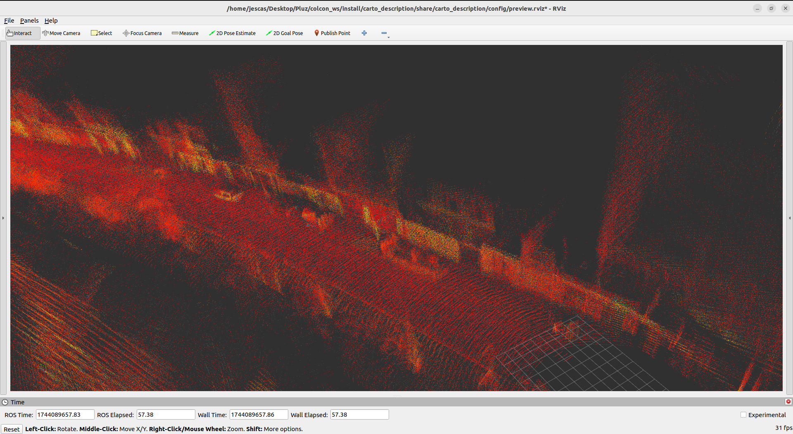

# PointCloud Assembler

The **PointCloud Assembler** is a ROS 2 node inspired by the original `laser_assembler` package, specifically tailored for the efficient assembly and management of `PointCloud2` data. This node handles data synchronization, transformations, and merging of point clouds over a specified time range, making it an essential tool for robotics and mapping applications that require precise point cloud integration.

## Features:
- **Point Cloud Merging**: Merges multiple `PointCloud2` messages based on time, creating a unified point cloud for processing.
- **TF2 Transformations**: Applies transformations between coordinate frames using TF2, ensuring the point clouds are aligned with a specified fixed frame of reference.
- **Time Range Queries**: Provides a service to merge point clouds within a specified time range, allowing dynamic and flexible cloud assembly.
- **Efficient Data Buffering**: Uses a circular buffer to store incoming point clouds, preventing overflow and retaining only relevant data for assembly.
- **Synchronization**: Synchronizes incoming point clouds with the necessary transforms using `message_filters` and `tf2_ros`.
- **Service Interface**: Implements a ROS 2 service (`AssemblerQuery`) for requesting merged point clouds within a given time window.
- **Real-time Performance**: Designed for handling large point cloud data efficiently while minimizing latency.

## Parameters:
- **`fixed_frame`** (default: `map`): The reference frame to which all point clouds are transformed.
- **`scan_buffer_size`** (default: `400`): The maximum number of point clouds to buffer. When the buffer is full, older clouds are discarded.

## Topics:
- **`/cloud_in`**: Subscribes to incoming `PointCloud2` messages (`sensor_msgs/msg/PointCloud2`) for processing.

## Services:
- **`assembler_service`**: A service to request a merged point cloud for a given time range.
  - **Request**: `begin` and `end` timestamps (seconds since epoch).
  - **Response**: Merged `PointCloud2` message with the points between the specified times.

### Example Service Request:
Use the following ROS 2 command to call the service with a desired time range:

```bash
ros2 service call /assembler_service carto_mapping.srv.AssemblerQuery "begin: 1614284253.0 end: 1614284323.0"
```

Run the following launch to see how the assembly is done:

```bash
ros2 launch
```

Let'see an application of this package:


